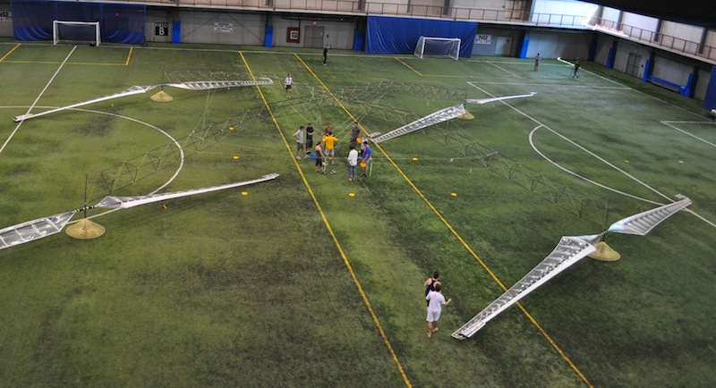

============================================================
Overview of the Atlas model
============================================================

The Atlas plugin is an OpenMDAO implementation of the design code used to model
the `Aerovelo Atlas
<http://www.aerovelo.com>`_ quad-rotor human-powered helicopter. In 2012, the Atlas won the
Igor I. Sikorsky Human Powered Helicopter Competition by successfully hovering for
over 60 seconds at an altitude over 3 meters.

As a design problem, the objective is to minimize the total power required
to hover, with respect to the angular velocity of the rotors. Constraints relating
to structural dynamics (strain, buckling failure, material failure, etc) are
also included. An optimization can be performed over a single design point or
over multiple design points, each representing a different set of operating
conditions (such as altitude or wind speed).

Many additional design variables may also be activated and added to the problem,
such as rotor size, thickness of structural members, among others. Canonically,
the optimization is formulated to minimize total power with respect to rotor
speed, such that lift is greater than or equal to total weight (including the pilot).