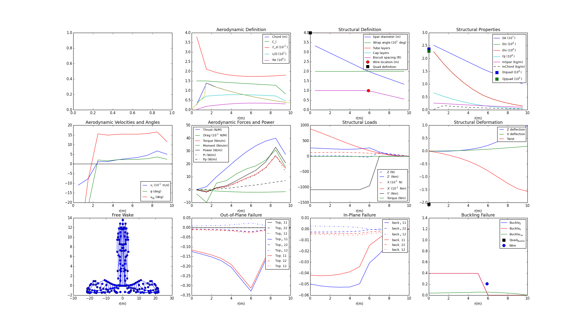
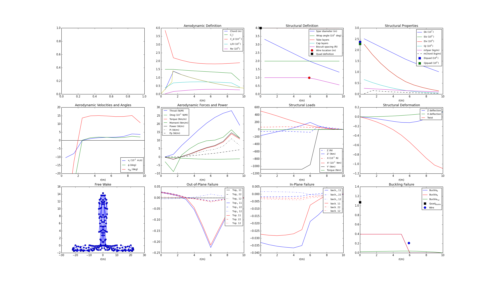

============================================================
Running the Atlas model (Single Design Point)
============================================================

To run the full Atlas model single-point optimization, load the AtlasConfiguration
and AeroStructural assemblies from the Atlas plugin. For this optimization,
the objective will be to minimize total power with respect to
the rotor speed, subject to the hovering constraint that lift must be greater or
equal to weight.

.. code-block:: python

    from Atlas import AtlasConfiguration, AeroStructural

Next, we set up an AtlasConfiguration assembly that will take into account
that the rotor speed Omega is a design variable.

.. code-block:: python

    class ConfigOpt(AtlasConfiguration):
        """ Atlas configuration for single point optimization """

        # inputs for optimizer
        Omega_opt = Float(iotype='in', desc='rotor angular velocity')

        def execute(self):
            super(ConfigOpt, self).execute()

            # use optimizer provided value for Omega
            self.Omega = self.Omega_opt

Similarly, define an AeroStructural assembly with passthroughs for variables
relevant to the optimization problem. There are rotor speed, total mass, total
lift, and total power.

.. code-block:: python

    class AeroStructuralOpt(AeroStructural):
        """ AeroStructural assembly for single point optimization """

        def configure(self):
            super(AeroStructuralOpt, self).configure()

            # replace config with optimizer driven config
            self.replace('config', ConfigOpt())

            # create passthroughs for variables used by the optimizer
            self.create_passthrough('config.Omega_opt')
            self.create_passthrough('struc.Mtot')
            self.create_passthrough('results.Ttot')
            self.create_passthrough('results.Ptot')

Now, define an assembly that will to set up the optimization problem. This
assembly will include the AeroStructural assembly defined above, along with
an optimization driver, SNOPT. If SNOPT is not available, the optimization
will fall back to SLSQP.

.. code-block:: python

    class HeliOpt(Assembly):
        """ Single point aero-structural optimization """

        def configure(self):
            # add an optimizer and an AeroStructural assembly
            if pyopt_driver and 'SNOPT' in pyopt_driver._check_imports():
                self.add("driver", pyopt_driver.pyOptDriver())
                self.driver.optimizer = "SNOPT"
                self.driver.options = {
                    # any changes to default SNOPT options?
                }
            else:
                print 'SNOPT not available, using SLSQP'
                self.add('driver', SLSQPdriver())

            self.add('aso', AeroStructuralOpt())

            # objective: minimize total power
            self.driver.add_objective('aso.Ptot')

            # parameter: rotor speed
            self.driver.add_parameter('aso.Omega_opt',
                                      low=0.15*2*pi, high=0.25*2*pi)
            self.aso.Omega_opt = 0.2*2*pi  # initial value

            # constraint: lift >= weight
            self.driver.add_constraint('aso.Mtot*9.8-aso.Ttot<=0')

Next, from the ``makeplot.py`` file in the "examples" directory in the Atlas plugin source directory,
load in the `plot_single` function. This function will generate a plot of model
performance and structural deformation information.

.. code-block:: python

    from makeplot import plot_single

To record data about the model to analyze following optimization, load in
the JSONCaseRecorder from OpenMDAO:

.. code-block:: python

    from openmdao.lib.casehandlers.api import JSONCaseRecorder

Now, we instantiate and run the optimization, then print the results:

.. code-block:: python

    opt = set_as_top(HeliOpt())

    opt.recorders.append(JSONCaseRecorder(out='heli_opt.json'))
    opt.run()

    print 'Parameter:  Omega       =', opt.aso.config.Omega
    print 'Constraint: Weight-Lift =', (opt.aso.Mtot*9.8-opt.aso.Ttot)
    print 'Objective:  Ptot        =', opt.aso.Ptot

    from openmdao.lib.casehandlers.api import CaseDataset
    dataset = CaseDataset('heli_opt.json', 'json')
    data = dataset.data.by_case().fetch()

    # plot baseline
    plot_single(data[0])

    # plot optimized
    plot_single(data[-1])

The plot_single() calls generate the following figures:

Baseline:

Optimized:

The full Atlas model can also be run by executing the ``heli_opt.py`` file in the
"examples" directory.

