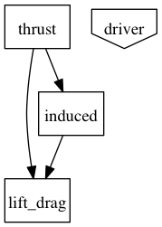
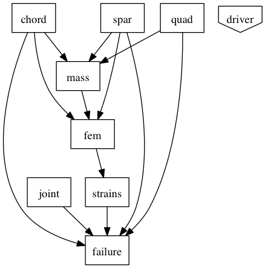
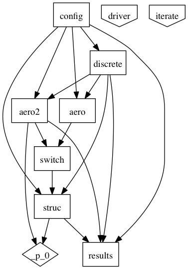

============================================================
Structure of the Atlas plugin
============================================================

The Atlas OpenMDAO plugin is organized in a hierarchical manner, separating
structural from aeronautical analysis through the use of OpenMDAO assemblies.

Aero()
------------

The `Aero()` assembly contains all components related to thrust, lift, drag, and
induced velocity calculations, which together total 3 components.

Structures()
------------

The 'Structures()' assembly contains all components related to FEA, structural deformation,
and materials properties, which together total 8 components.

AeroStructural()
-----------------

The `AeroStructural()` assembly contains both a low-fidelity and high fidelity
`Aero()` instance, along with a `Structures()` instance.

This assembly's execution iterates twice between aero and structural disciplines.
The low fidelity
`Aero()` assembly computes induced velocity using a simple blade element model.
Structural deformation is then computing by the `Structures()` assembly.
This is then fed to a higher fidelity aero assembly, `Aero2()`, which uses a more
accurate vortex wake calculation. Structural deformation is then computed one last time.

The values for input parameters (and potential design variables) are set in
the `config()` component, which propagates values throughout the rest of the
assembly.

`AeroStructural()` also contains
a `DiscretizeProperties()` component, which takes discretization parameters
as input from `config()`, and outputs variables discretized in space (typically along the
rotor blades).

Finally, the `results()` component aggregates the final results of the
assembly execution, and computes several values relevant to the objective and
constraints for the optimization problem. These include total power, aerodynamic
 jig and dihedral angles.

AtlasConfiguration()
---------------------
The `AtlasConfiguration()` component acts as the starting point for an
optimization. It exposes design variables and configuration parameters, and
propagates their values appropriately.